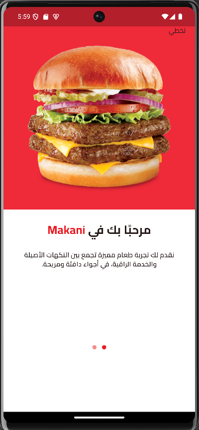
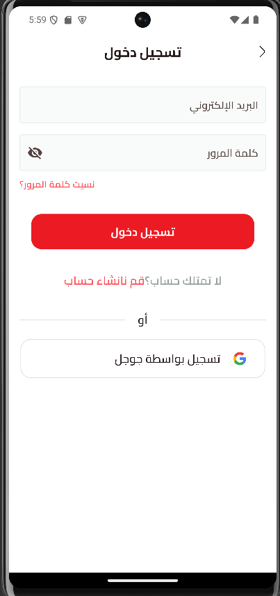
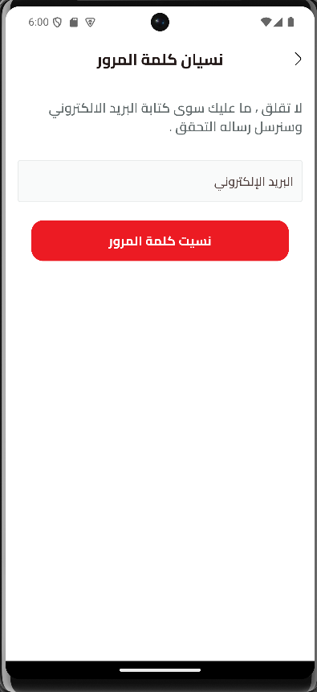
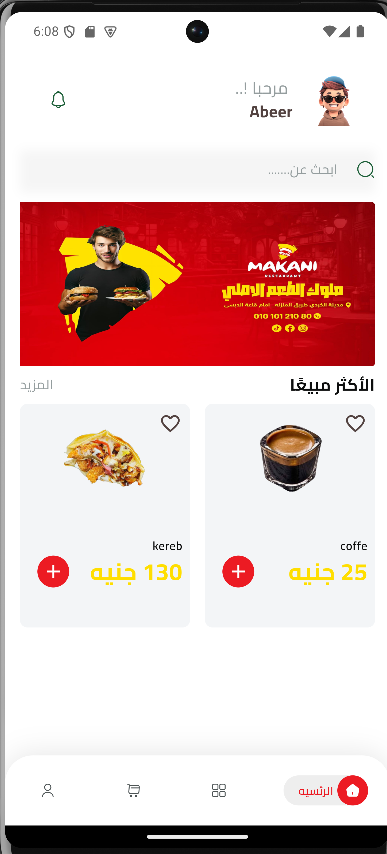
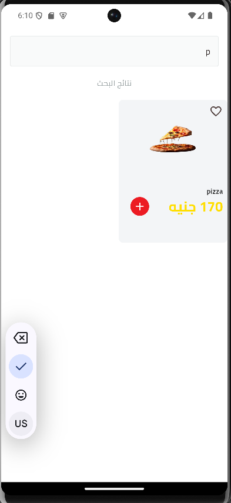
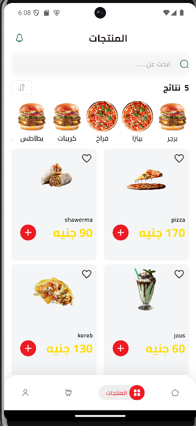
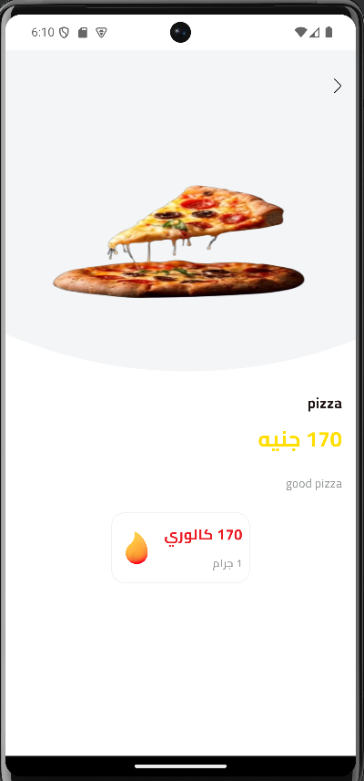
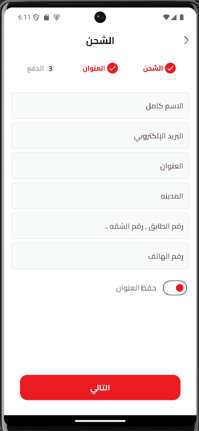
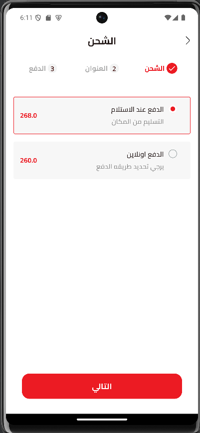
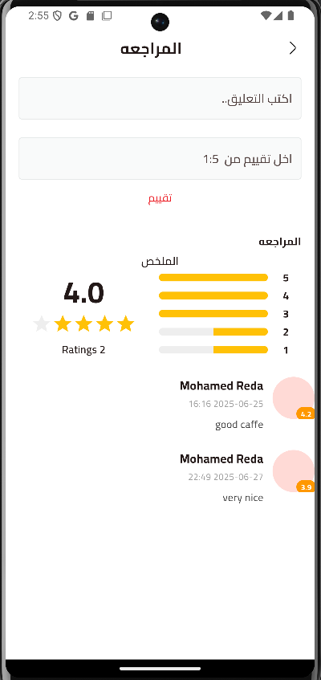

# 🍽️ Makani

تطبيق مطعم تفاعلي باستخدام Flutter يسمح بتصفح قائمة الطعام، إضافة الطلبات للسلة، وتتبع الطلبات.

## 🚀 الخصائص الرئيسية

- تسجيل دخول وتسجيل مستخدم جديد
- تصفح قائمة الطعام
- إضافة أطباق إلى السلة وإتمام الطلب
- تتبع حالة الطلب
- واجهة استخدام متجاوبة وسهلة
- تكامل مع Firebase (لإدارة المنتجات، الطلبات، والمستخدمين)
- أداء عالي بفضل تطبيق أفضل ممارسات Flutter

## 📦 التقنيات والحزم المستخدمة

- Flutter SDK
<<<<<<< HEAD
- flutter_launcher_icons
- device_preview
- shared_preferences
- flutter_screenutil
- device_previewdevice_preview
- dartz
- auto_size_text
- equatable
- flutter_paypal_payment
- cached_network_image
- skeletonizer
- Firebase Auth, Firestore, Supabase
- cubit 
=======
- Firebase Auth, Firestore, Messaging
- Provider أو Riverpod أو Bloc
>>>>>>> f0387b50efddd479ec9139629e0b5f1bc03e690b
- وغيرها...

## 📸 لقطات شاشة

### 🧭 شاشات البداية وتسجيل الدخول والخروج

  
  
  

### 🔐 نسيت كلمة المرور والشاشة الرئيسية والبحث

  
  
  

### 🍔 المنتج، العروض، الفلترة

  
  
  

### 🍽️ عرض الوجبة، السلة، العنوان

  
  
  

### 🚚⭐ تقييم الطلب الشحن والدفع

  
  
  

## 📥 تنزيل التطبيق

لتحميل نسخة APK الخاصة بالتطبيق:  
📥 [Download APK - v1.0.0](https://drive.google.com/file/d/1kL7mltgGhJp-LtMYjyFAWJ_KRCpsDbMh/view?usp=drive_link)

